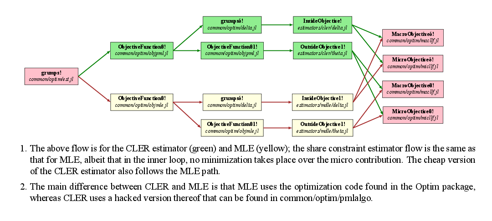

# Algorithm flow

When Grumps is called using the `grumps!` call, it runs the `grumps!` method in `est.jl` in the `optim` folder.  This sets up various objects and then calls an optimizer with an objective function that is estimator-specific.  In other words, it will call a different method depending on the `e` argument in `ObjectiveFunctionθ!` in `est.jl` in the `optim` folder.

These methods `ObjectiveFunctionθ!` are defined either in one of the Julia files in the `optim` folder whose name starts with obj, or in a specific estimator folder; see [estimators folder](@ref).  `ObjectiveFunctionθ!` then decides which internal optimizer (i.e. one that finds $\delta$) to call: they're all called `grumpsδ!`.

After optimization is completed, Grumps will call a standard error computation routine and then return.
